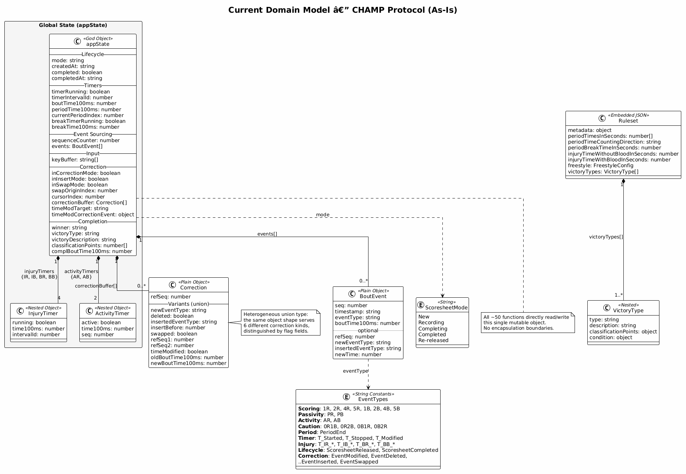
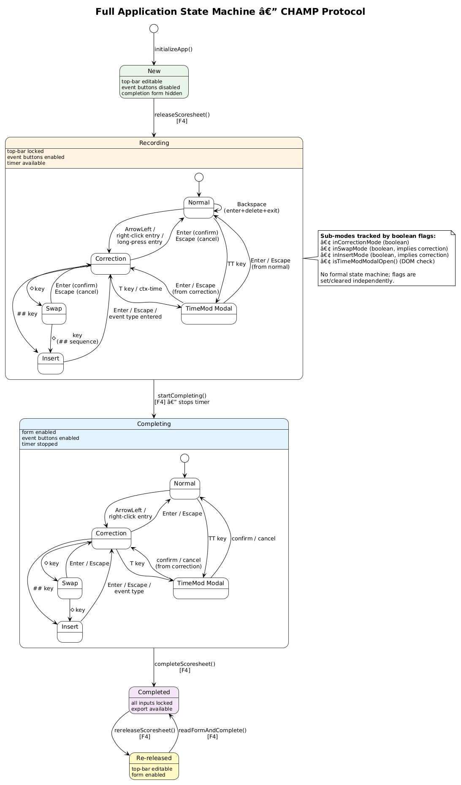
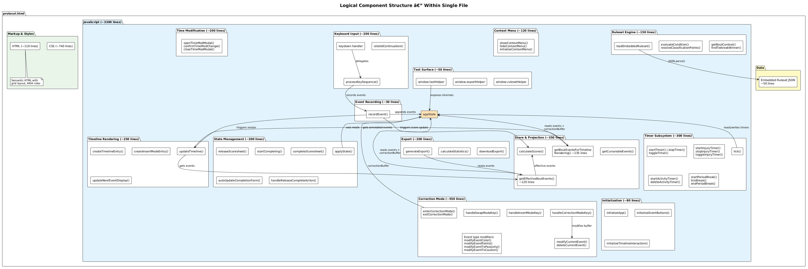
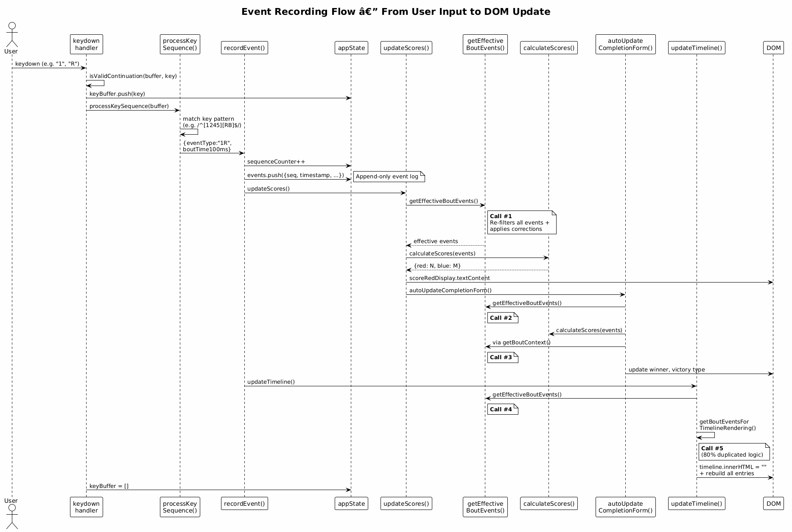
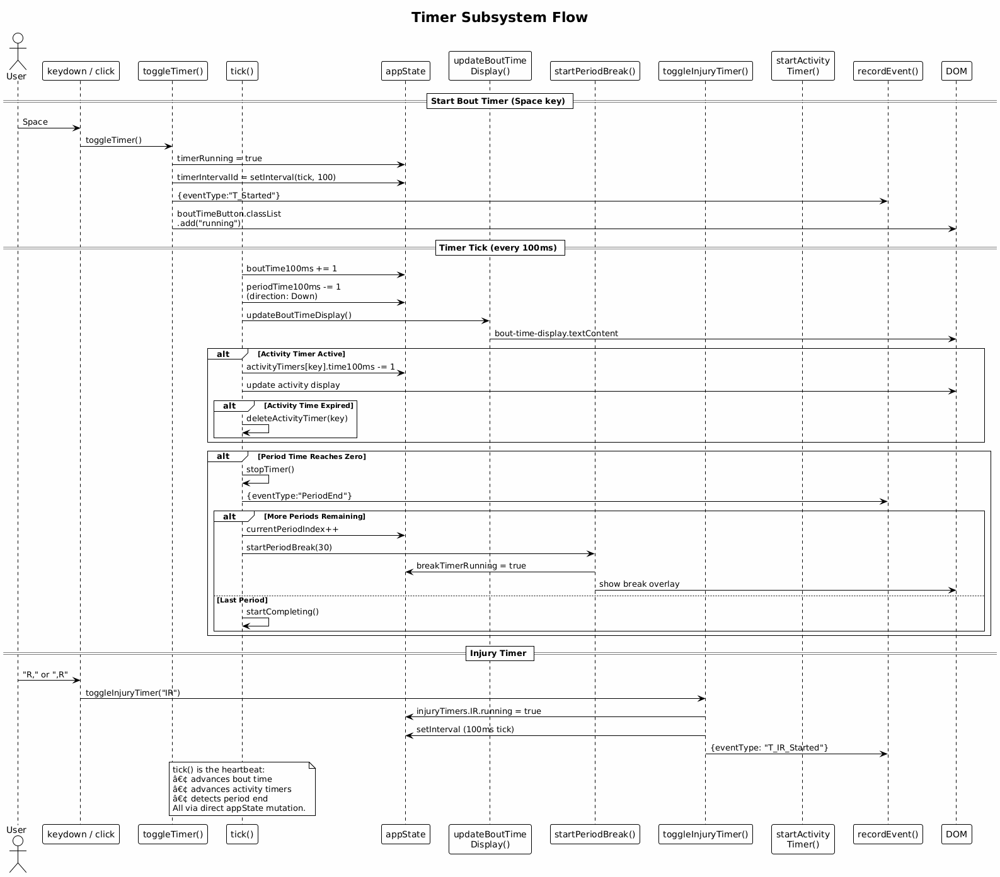
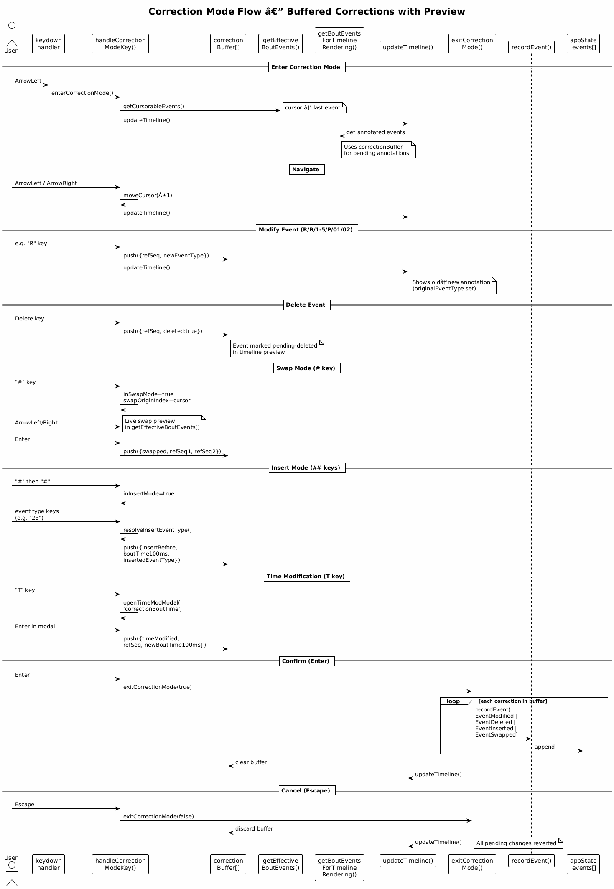

# Architecture and Design — CHAMP Protocol

A concise description of the current architecture and design of the CHAMP Protocol application (`protocol/protocol.html`), a single-file HTML5 app for live recording of wrestling bouts.

---

## Table of Contents

1. [System Overview](#1-system-overview)
2. [Domain Model](#2-domain-model)
3. [Application State Machine](#3-application-state-machine)
4. [Component Structure](#4-component-structure)
5. [Event Recording Flow](#5-event-recording-flow)
6. [Timer Subsystem](#6-timer-subsystem)
7. [Correction Flow](#7-correction-flow)
8. [Patterns and Architectural Decisions](#8-patterns-and-architectural-decisions)
9. [Assessment](#9-assessment)

---

## 1. System Overview

CHAMP Protocol is a zero-dependency, offline-first, single-file HTML5 application for live recording of wrestling bouts. Everything — markup, styles, data, and logic — lives inside one file (`protocol.html`, ~4200 lines).

| Section | Lines | Purpose |
|---|---|---|
| HTML markup | ~110 | Semantic structure (grid layout, ARIA roles) |
| Inline CSS | ~740 | All styles, responsive design, color theming |
| Embedded JSON | ~50 | Default ruleset (`<script type="application/json">`) |
| Inline JavaScript | ~3300 | All application logic, organized by comment banners |

The application supports a complete bout-recording lifecycle: preparation, real-time event recording with keyboard-first UX, multi-modal correction, completion with automatic victory-type determination, and JSON export. Testing is done exclusively via Playwright E2E tests.

---

## 2. Domain Model



### 2.1 Central State Object

All application state resides in a single global object `appState` with 25+ mutable fields, grouped by concern:

| Field Group | Fields | Purpose |
|---|---|---|
| **Lifecycle** | `mode`, `createdAt`, `completed`, `completedAt` | Scoresheet state and timestamps |
| **Timers** | `timerRunning`, `timerIntervalId`, `boutTime100ms`, `periodTime100ms`, `currentPeriodIndex`, `breakTimerRunning`, `breakTime100ms` | Bout, period, and break timing |
| **Injury Timers** | `injuryTimers: {IR, IB, BR, BB}` | Per-side injury and blood timers (each: `running`, `time100ms`, `intervalId`) |
| **Activity Timers** | `activityTimers: {AR, AB}` | Per-side activity timers (each: `active`, `time100ms`, `seq`) |
| **Event Sourcing** | `sequenceCounter`, `events[]` | Append-only event log with monotonic sequence |
| **Input** | `keyBuffer[]` | Multi-key input sequence buffer |
| **Correction** | `inCorrectionMode`, `inInsertMode`, `inSwapMode`, `swapOriginIndex`, `cursorIndex`, `correctionBuffer[]`, `timeModTarget`, `timeModCorrectionEvent` | Correction session state |
| **Completion** | `winner`, `victoryType`, `victoryDescription`, `classificationPoints`, `complBoutTime100ms` | Bout result data |

### 2.2 Event Types

Events are plain objects `{seq, timestamp, eventType, boutTime100ms, ...}` distinguished by string `eventType`. There is no type registry; event types are identified via regex matching throughout the codebase.

| Category | Event Types |
|---|---|
| Scoring | `1R`, `2R`, `4R`, `5R`, `1B`, `2B`, `4B`, `5B` |
| Passivity | `PR`, `PB` |
| Activity Time | `AR`, `AB` |
| Cautions | `0R1B`, `0R2B`, `0B1R`, `0B2R` |
| Period | `PeriodEnd` |
| Timer Control | `T_Started`, `T_Stopped`, `T_Modified` |
| Injury Timer | `T_IR_Started`, `T_IR_Stopped`, `T_IR_Modified`, etc. |
| Lifecycle | `ScoresheetReleased`, `ScoresheetCompleted` |
| Corrections | `EventModified`, `EventDeleted`, `EventInserted`, `EventSwapped` |

### 2.3 Correction Buffer

Pending corrections during an active correction session are held in `correctionBuffer[]` as a heterogeneous union — a single object shape serves six correction kinds, distinguished by flag fields:

- **Modify**: `{refSeq, newEventType}`
- **Delete**: `{refSeq, deleted: true}`
- **Insert**: `{insertBefore, boutTime100ms, insertedEventType}`
- **Swap**: `{swapped: true, refSeq1, refSeq2}`
- **Time Modify**: `{timeModified: true, refSeq, oldBoutTime100ms, newBoutTime100ms, eventType, insertBefore}`

On confirmation, each pending correction is committed as an append-only event to the log.

### 2.4 Ruleset

The ruleset is embedded as a JSON `<script>` block and parsed on demand via `loadEmbeddedRuleset()`. It defines:

- Period times and counting direction
- Break duration
- Injury/blood time limits
- Activity time configuration (freestyle-specific)
- Victory types with conditions and classification point formulas

Victory type conditions use a declarative operator notation (`{gte, lte, gt, lt, eq}`) evaluated against a bout context object.

---

## 3. Application State Machine



### 3.1 Top-Level Modes

The scoresheet has five explicit modes stored in `appState.mode`:

```
New → Recording → Completing → Completed ⇄ Re-released
```

| Mode | Entry Trigger | UI State |
|---|---|---|
| **New** | Page load | Top-bar editable, events disabled, form hidden |
| **Recording** | `releaseScoresheet()` / F4 | Top-bar locked, events enabled, timer available |
| **Completing** | `startCompleting()` / F4 | Form enabled, events enabled, timer stopped |
| **Completed** | `completeScoresheet()` / F4 | All locked, export available |
| **Re-released** | `rereleaseScoresheet()` / F4 | Top-bar editable, form enabled |

Mode transitions are managed by `applyState()` which configures UI element visibility, disabled states, and locks using a declarative configuration table:

```javascript
const cfg = {
  'New':         ['Freigeben [F4]',    freezeForm, freezeEvt, hideExport, unlockTopBar],
  'Recording':   ['Fertigstellen [F4]', freezeForm, enableEvt, hideExport, lockTopBar],
  // ...
};
```

### 3.2 Sub-Modes (Recording / Completing)

Within Recording and Completing, the app has nested sub-modes tracked via independent boolean flags:

| Sub-Mode | Flags | Entry | Exit |
|---|---|---|---|
| **Normal** | all false | default | — |
| **Correction** | `inCorrectionMode=true` | ArrowLeft / right-click / long-press | Enter (confirm) / Escape (cancel) |
| **Swap** | `inSwapMode=true` (implies correction) | `#` key in correction | Enter / Escape |
| **Insert** | `inInsertMode=true` (implies correction) | `##` key sequence | Enter / Escape / event type entered |
| **Time Mod Modal** | DOM visibility check | `TT` key / `T` in correction / right-click timer | Enter / Escape in modal |

These flags are not a formal state machine — they are set and cleared independently. Invariants (e.g., swap implies correction) are enforced by control flow, not by the data structure.

---

## 4. Component Structure



The JavaScript is organized into ~16 sections delineated by comment banners (`// === SECTION ===`). While these provide navigational structure, there are no actual encapsulation boundaries — all ~50 functions share the global scope and can freely access `appState` and each other.

### 4.1 Section Inventory

| Section | ~Lines | Key Functions |
|---|---|---|
| **App State** | 50 | `appState` definition |
| **Timer Logic** | 100 | `tick()`, `startTimer()`, `stopTimer()`, `toggleTimer()` |
| **Injury Timer** | 85 | `startInjuryTimer()`, `stopInjuryTimer()`, `toggleInjuryTimer()` |
| **Activity Timer** | 100 | `getActivityTimeConfig()`, `shouldUseActivityTime()`, `startActivityTimer()` |
| **Time Modification** | 200 | `openTimeModModal()`, `confirmTimeModChange()` (150 lines, 5 code paths) |
| **Event Recording** | 30 | `recordEvent()` — appends event, triggers score + timeline update |
| **State Management** | 300 | `applyState()`, `releaseScoresheet()`, `completeScoresheet()`, `autoUpdateCompletionForm()` |
| **Score Calculation** | 100 | `getEffectiveBoutEvents()` (~120 lines), `calculateScores()` |
| **Timeline Rendering** | 250 | `updateTimeline()`, `createTimelineEntry()`, `getBoutEventsForTimelineRendering()` (~135 lines) |
| **Next-Event Display** | 60 | `getNextEventDisplayData()`, `updateNextEventDisplay()` |
| **Keyboard Input** | 200 | `processKeySequence()`, `isValidContinuation()`, global `keydown` handler |
| **Correction Mode** | 550 | `enterCorrectionMode()`, `exitCorrectionMode()`, `handleCorrectionModeKey()`, swap/insert/modify functions |
| **Context Menu** | 120 | `showContextMenu()`, `initializeContextMenu()` |
| **Timeline Interaction** | 100 | `enterCorrectionModeAtSeq()`, click/contextmenu delegation |
| **Ruleset Engine** | 150 | `loadEmbeddedRuleset()`, `evaluateCondition()`, `resolveClassificationPoints()`, `getBoutContext()` |
| **Export** | 200 | `generateExport()`, `calculateStatistics()`, `downloadExport()` |
| **Test Surface** | 50 | `window.testHelper`, `window.exportHelper`, `window.rulesetHelper` |
| **Initialization** | 80 | `initializeApp()`, button/event listener setup |

### 4.2 Test Surface

Three `window`-scoped helper objects expose internal state for Playwright E2E tests:

- **`testHelper`**: `getState()`, `injectEvent()`, `setPeriodTime100ms()`, `setBoutTime100ms()`, `setInjuryTime100ms()`, `setActivityTime100ms()`, `triggerPeriodBreak()`
- **`exportHelper`**: `generate()`, `download()`
- **`rulesetHelper`**: `load()`, `validate()`, `evaluateCondition()`, `getBoutContext()`, etc.

Hidden `#start` / `#stop` buttons provide additional test hooks to bypass mode checks for timer control.

---

## 5. Event Recording Flow



### 5.1 Input → Event → Render Pipeline

1. **Input**: User presses keys (e.g., `1`, `R`). The global `keydown` handler validates each key via `isValidContinuation()` and appends to `keyBuffer`.
2. **Sequence Resolution**: `processKeySequence()` pattern-matches the buffer against known event types (technical points, cautions, passivity, timer commands).
3. **Event Recording**: `recordEvent()` assigns a monotonic sequence number, timestamps the event, pushes it onto `appState.events[]`, and triggers UI updates.
4. **Score Update**: `updateScores()` → `calculateScores(getEffectiveBoutEvents())` recomputes scores from the full effective event list.
5. **Auto-Completion**: `autoUpdateCompletionForm()` determines winner, matches victory type against ruleset conditions, and populates the completion form.
6. **Timeline Rebuild**: `updateTimeline()` clears the DOM and rebuilds all timeline entries from scratch.

### 5.2 Event Projection

`getEffectiveBoutEvents()` is the central projection function. It:

1. Filters raw events to visible bout events (excludes timer, lifecycle, and correction meta-events)
2. Applies committed corrections (`EventModified`, `EventDeleted`, `EventInserted`, `EventSwapped`)
3. Applies pending corrections from `correctionBuffer[]`
4. Applies live swap preview (during swap mode navigation)
5. Applies pending time modifications

A near-identical function `getBoutEventsForTimelineRendering()` adds annotation properties (`pendingDeleted`, `originalEventType`, `isPendingInserted`) for visual rendering of pending corrections. The two functions share ~80% of their logic.

---

## 6. Timer Subsystem



### 6.1 Timer Types

| Timer | Storage | Tick Source | Direction |
|---|---|---|---|
| **Bout Timer** | `appState.boutTime100ms` / `periodTime100ms` | `tick()` via `setInterval(100ms)` | boutTime counts up, periodTime counts down |
| **Period Break** | `appState.breakTime100ms` | `tickBreak()` via `setInterval(100ms)` | Counts down |
| **Injury (IR/IB)** | `appState.injuryTimers.IR/.IB` | Separate `setInterval` per timer | Counts up |
| **Blood (BR/BB)** | `appState.injuryTimers.BR/.BB` | Separate `setInterval` per timer | Counts up |
| **Activity (AR/AB)** | `appState.activityTimers.AR/.AB` | Driven by `tick()` (piggybacks on bout timer) | Counts down |

### 6.2 The `tick()` Function

`tick()` is the application heartbeat, called every 100ms while the bout timer runs. It:

1. Advances `boutTime100ms` (+1) and `periodTime100ms` (-1)
2. Updates the bout time display
3. Advances active activity timers; deletes them on expiry
4. Detects period end (periodTime reaches 0): stops timer, records `PeriodEnd`, and either starts a period break or triggers completion

### 6.3 Injury / Blood Timers

Each of the four injury timers runs independently with its own `setInterval`. Maximum time depends on type (120s for injury without blood, 240s for blood) from the ruleset. Time modification is possible via a modal dialog (right-click or `T,R` / `T.R` key sequences).

### 6.4 Activity Timer

Activity time is ruleset-conditional (freestyle only, after 2+ passivity events). It counts down from 30s, attached to a specific event `seq`. When the timer expires or the wrestler scores, it auto-deletes and records a `T_AR_Expired` / `T_AB_Expired` event.

---

## 7. Correction Flow



### 7.1 Entering Correction Mode

Correction mode is entered from Recording or Completing via:
- **ArrowLeft**: Cursor placed on the last cursorable event
- **Right-click / long-press** on a timeline entry: Cursor placed on that specific event
- **Backspace**: Enters correction mode and immediately deletes the last event

### 7.2 Sub-Modes

| Sub-Mode | Entry | Available Actions | Exit |
|---|---|---|---|
| **Edit** (default) | Enter correction | Navigate (←/→), Modify (R/B/1-5/P/01/02), Delete (Del), Time modify (T) | Enter/Escape |
| **Swap** | `#` key | Navigate to pick swap target, live preview | Enter (confirm) / Escape (cancel) |
| **Insert** | `##` key sequence | Type event keys to insert before cursor position | Event type resolved / Escape |

### 7.3 Buffered Corrections

All changes during a correction session accumulate in `correctionBuffer[]` without modifying the event log. The timeline renders a live preview with annotations (strikethrough for deletions, old→new for modifications, insert markers).

On confirmation (Enter), `exitCorrectionMode(true)` iterates the buffer and commits each correction as a new event (`EventModified`, `EventDeleted`, `EventInserted`, `EventSwapped`). On cancel (Escape), the buffer is discarded.

### 7.4 Context Menu

A floating context menu appears at the cursor position offering: Delete, Insert (##), Swap (#), Time Modify (T). It dynamically disables actions that aren't applicable (e.g., no swap/insert on virtual pending events).

---

## 8. Patterns and Architectural Decisions

### 8.1 Patterns Used

| Pattern | Where | Implementation |
|---|---|---|
| **Event Sourcing** | Event log | Append-only `events[]`, corrections as events, derived projections |
| **Command Buffer** | Keyboard input | `keyBuffer[]` accumulates keys; `processKeySequence()` resolves commands |
| **Correction Buffer** (Transactional Outbox) | Correction mode | Pending changes buffered, committed atomically or discarded |
| **Observer** (implicit) | `recordEvent()` | Side-effect cascade: `updateScores()` → `updateTimeline()` |
| **Strategy** (implicit) | Ruleset conditions | `evaluateCondition()` dispatches on operator keys (`gte`, `lte`, etc.) |
| **State Pattern** (partial) | `applyState()` | Declarative config table maps mode → UI configuration |
| **Singleton** | `appState` | Single global mutable object — all functions share one instance |

### 8.2 Key Architectural Decisions

1. **Single-file constraint**: Zero build tools, zero CDN dependencies, zero frameworks. All markup, styles, and logic inlined. This satisfies the offline-first requirement and ensures maximum portability.

2. **Event sourcing for audit trail**: The event log preserves every action including corrections. Scores and the timeline are always recomputed from events, ensuring consistency. This makes the JSON export a complete record of the bout.

3. **Keyboard-first UX with button fallback**: Two-key sequences (e.g., `1R`, `0R2`) enable rapid data entry. Buttons map to the same key sequences via `simulateKeySequence()`.

4. **DOM as view layer**: No virtual DOM, no templating. `updateTimeline()` rebuilds the entire timeline on each change. At the scale of a wrestling bout (~20-60 events), this is sufficient.

5. **No persistence**: No localStorage, no IndexedDB. The browser tab is the session; the JSON export is the persistence mechanism.

6. **Playwright-only testing**: No unit tests. All testing through E2E browser automation, supported by `window.testHelper` for state injection/inspection.

---

## 9. Assessment

### 9.1 Strengths

**Event sourcing as source of truth.** The append-only event log with corrections-as-events is the strongest architectural element. It naturally supports undo (via correction events), provides a complete audit trail, and makes the export a faithful record of the bout. Scores and timeline are always derived from events, eliminating state synchronization bugs.

**Effective constraint alignment.** The single-file, zero-dependency design perfectly matches the offline requirement. The absence of build tools, frameworks, and external dependencies maximizes portability and deployment simplicity. The application loads offline from a file URL with full functionality.

**Clear lifecycle model.** The five-state scoresheet lifecycle (New → Recording → Completing → Completed → Re-released) maps directly to the domain and is consistently enforced across UI transitions, event recording, and export.

**Keyboard-first input model.** The key-buffer pattern (`keyBuffer` → `isValidContinuation()` → `processKeySequence()`) is elegant: it handles multi-key sequences, provides live visual feedback via the next-event display, and naturally supports both keyboard and touch input.

**Comprehensive correction system.** The correction mode with edit, swap, insert, and time-modification sub-modes — all buffered with live preview and atomic commit/cancel — is remarkably capable for a prototype.

### 9.2 Weaknesses

**God Object anti-pattern.** `appState` holds 25+ mutable fields spanning five distinct concerns (lifecycle, timers, events, correction, completion). All ~50 functions directly read and write it. There are no encapsulation boundaries, no access control, and no invariant enforcement by the data structure itself.

**No separation of concerns.** Domain logic (scoring, event processing), presentation (DOM manipulation), state management (mode transitions), and input handling (keyboard, mouse, touch) are interleaved throughout the codebase. For example, `recordEvent()` both appends to the event log (domain) and triggers `updateScores()` + `updateTimeline()` (presentation).

**Implicit sub-mode state machine.** Correction sub-modes (edit, swap, insert, time-mod) are tracked by independent boolean flags. The invariant that swap and insert imply correction mode is enforced by control flow, not by the type system. This makes illegal state combinations theoretically representable.

**Duplicated projection logic.** `getEffectiveBoutEvents()` and `getBoutEventsForTimelineRendering()` share ~80% of their code (event filtering, committed correction application, pending correction application). Both are recomputed from scratch on every call — typically 3-5 times per user action.

**Repeated JSON parsing.** `loadEmbeddedRuleset()` calls `JSON.parse()` on every invocation, including inside `tick()` (every 100ms while the timer runs). The result is static and should be cached.

**DRY violations in event-type parsing.** The regex `e.eventType.match(/^([1245])(R|B)$/)` appears in 8 different locations. There is no event-type registry or centralized type knowledge.

**No unit-testable modules.** All logic depends on the DOM and global state. Pure functions like `calculateScores()` and `evaluateCondition()` could be independently tested if extracted into isolated modules.

### 9.3 Architectural Risks

- **Change amplification**: Adding a new event type requires modifications in 6+ locations (input, scoring, statistics, timeline rendering, color mapping, correction modifiers).
- **Cognitive load**: Understanding any single feature requires tracing through multiple interleaved concern areas.
- **Refactoring risk**: The tight coupling between `testHelper` and `appState` internals means internal restructuring risks breaking the test suite.
- **Performance ceiling**: While negligible at current scale, the O(events × corrections) recomputation on every action would become visible with significantly larger bout logs.

### 9.4 Summary

The CHAMP Protocol is a well-functioning prototype with solid domain coverage and a strong event-sourcing foundation. Its architecture is appropriate for a rapid-prototyping phase: simple, direct, and constraint-aligned. The primary architectural debt is the lack of encapsulation boundaries — the god object, interleaved concerns, and duplicated logic. Addressing these through incremental refactoring (module extraction, projection caching, state machine formalization) would significantly improve maintainability while preserving the single-file, zero-dependency constraint.

---

## Appendix: Diagram Sources

All PlantUML diagram sources and generated PNGs are in `img/`:

| Diagram | Source | PNG |
|---|---|---|
| Domain Model | [ad-domain-model.puml](img/ad-domain-model.puml) | [ad-domain-model.png](img/ad-domain-model.png) |
| State Machine | [ad-state-machine.puml](img/ad-state-machine.puml) | [ad-state-machine.png](img/ad-state-machine.png) |
| Component Structure | [ad-component-structure.puml](img/ad-component-structure.puml) | [ad-component-structure.png](img/ad-component-structure.png) |
| Event Recording Flow | [ad-event-recording-sequence.puml](img/ad-event-recording-sequence.puml) | [ad-event-recording-sequence.png](img/ad-event-recording-sequence.png) |
| Timer Subsystem | [ad-timer-flow.puml](img/ad-timer-flow.puml) | [ad-timer-flow.png](img/ad-timer-flow.png) |
| Correction Flow | [ad-correction-flow.puml](img/ad-correction-flow.puml) | [ad-correction-flow.png](img/ad-correction-flow.png) |

To regenerate PNGs:

```bash
# Using Python (requires plantuml package):
pip install plantuml six
python -c "
import plantuml, glob, os
server = plantuml.PlantUML(url='http://www.plantuml.com/plantuml/img/')
for f in glob.glob('protocol/spec/img/ad-*.puml'):
    server.processes_file(f, f.replace('.puml', '.png'))
"

# Or with Java + PlantUML JAR:
java -jar plantuml.jar protocol/spec/img/ad-*.puml
```
