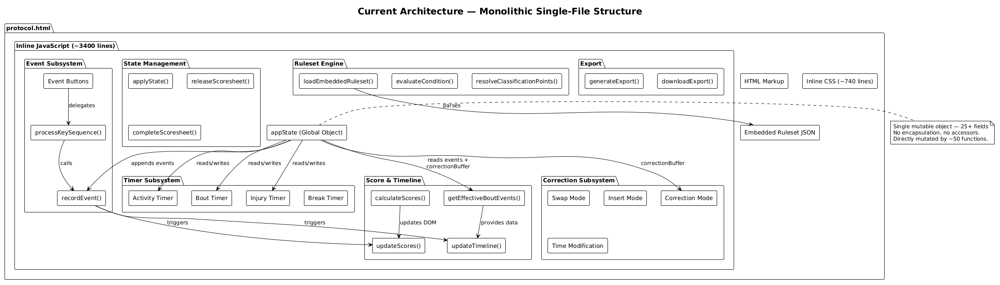
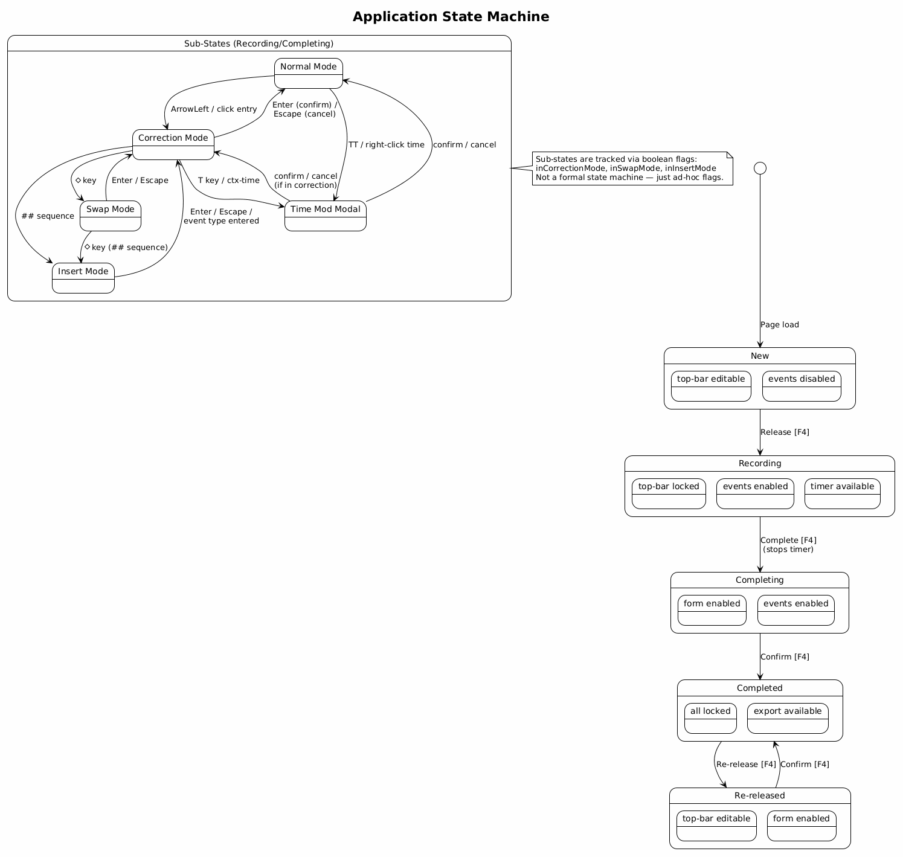
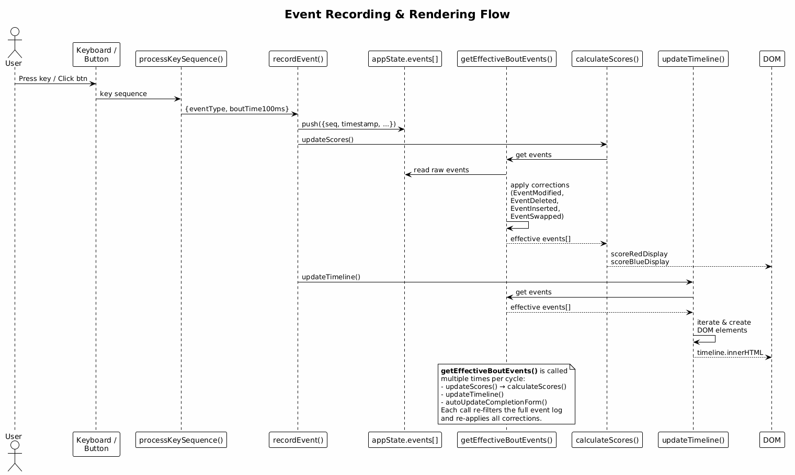
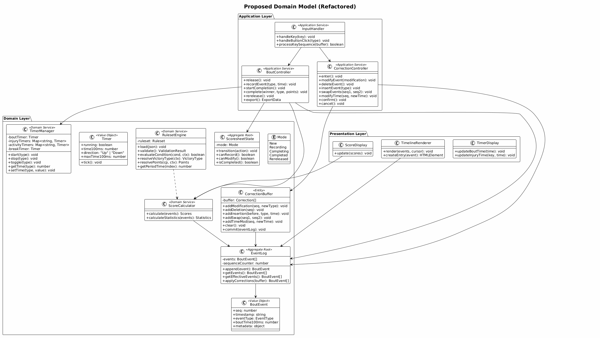
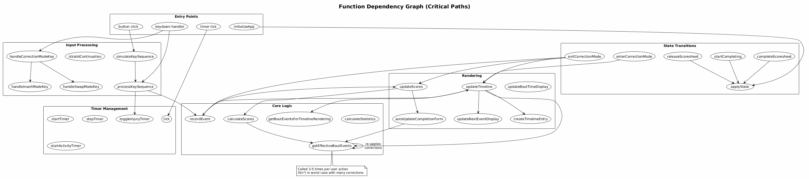
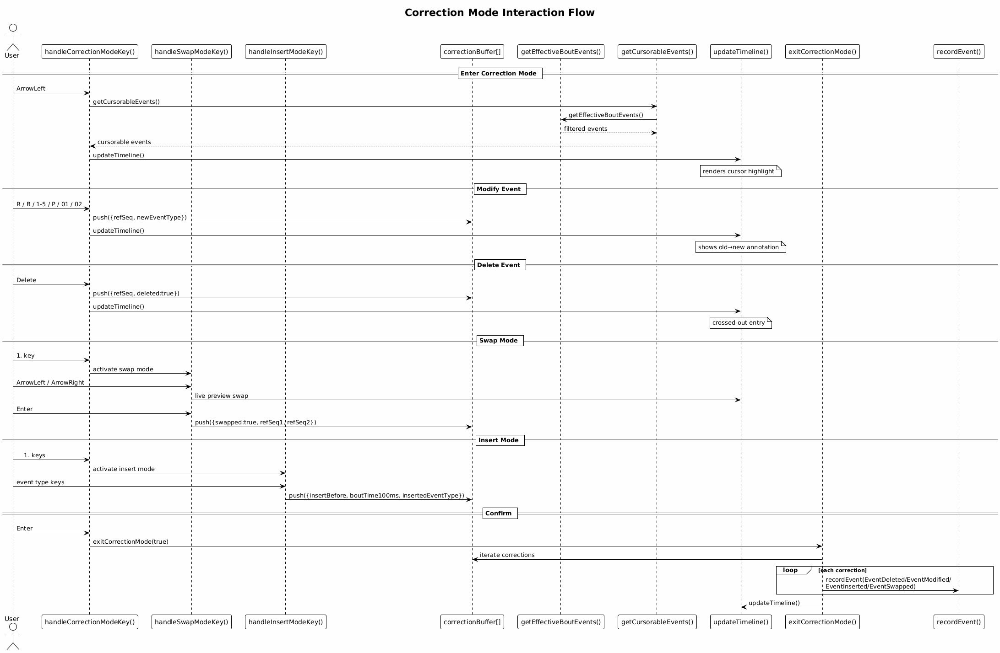

# Architecture and Design Review — CHAMP Protocol

This document provides an in-depth architecture and design review of the CHAMP Protocol application (`protocol/protocol.html`), a single-file HTML5 app for live recording of wrestling bouts.

The review evaluates the current design against established software engineering principles — DDD, SOLID, DRY, KISS, YAGNI, event sourcing, separation of concerns, and functional programming idioms — and offers concrete, actionable recommendations for improvement.

---

## Table of Contents

1. [Executive Summary](#1-executive-summary)
2. [Current Architecture Overview](#2-current-architecture-overview)
3. [State Management](#3-state-management)
4. [Event Sourcing Analysis](#4-event-sourcing-analysis)
5. [Separation of Concerns](#5-separation-of-concerns)
6. [SOLID Principles](#6-solid-principles)
7. [DRY Analysis](#7-dry-analysis)
8. [KISS and YAGNI](#8-kiss-and-yagni)
9. [Functional Programming Opportunities](#9-functional-programming-opportunities)
10. [Domain-Driven Design](#10-domain-driven-design)
11. [Code Structure and Organization](#11-code-structure-and-organization)
12. [Performance Considerations](#12-performance-considerations)
13. [Testability](#13-testability)
14. [Recommendations Summary](#14-recommendations-summary)
15. [Proposed Refactored Architecture](#15-proposed-refactored-architecture)

---

## 1. Executive Summary

The CHAMP Protocol is a well-functioning prototype with solid domain coverage. Its approximately 4,200 lines of inline HTML, CSS, and JavaScript deliver a complete bout-recording workflow: preparation, real-time event recording, multi-mode correction, completion, and JSON export.

**Strengths:**
- The event log as append-only source of truth is a strong foundation for event sourcing
- Clear five-state lifecycle (New → Recording → Completing → Completed → Re-released)
- Effective keyboard-first UX with button fallbacks
- Comprehensive test coverage via Playwright E2E tests
- Offline-capable, zero-dependency design

**Key Concerns:**
- **God Object**: `appState` is a single mutable object with 25+ fields, directly mutated by ~50 functions
- **No Separation of Concerns**: Domain logic, presentation, state management, and input handling are interleaved in one flat namespace
- **DRY Violations**: Significant code duplication in event filtering, score calculation, and timeline rendering
- **Missing State Machine**: Application modes managed by ad-hoc boolean flags instead of a formal state machine
- **Performance**: `getEffectiveBoutEvents()` is called 3-5 times per user action, each time re-processing the entire event log

---

## 2. Current Architecture Overview



The entire application lives in a single HTML file with three inline sections:

| Section | Approximate Lines | Purpose |
|---|---|---|
| HTML markup | ~110 | Semantic structure, UI elements |
| CSS `<style>` | ~740 | All styles inline |
| JSON `<script>` | ~50 | Embedded default ruleset |
| JS `<script>` | ~3,300 | All application logic |

The JavaScript is organized into labeled sections via comment banners (`// === SECTION ===`):

```
APP STATE → TIMER LOGIC → INJURY TIMER → ACTIVITY TIMER →
EVENT RECORDING → STATE MANAGEMENT → SCORE CALCULATION →
TIMELINE RENDERING → NEXT-EVENT DISPLAY → KEYBOARD INPUT →
CORRECTION MODE → EVENT BUTTON HANDLERS → CONTEXT MENU →
TIMELINE INTERACTION → RULESET HELPER → EXPORT → INITIALIZATION
```

While the comment-based sectioning provides navigational hints, there is no actual encapsulation boundary between sections. Every function can (and does) freely access `appState` and any other function.

### Advantages of Current Design
- **Simplicity**: Zero build tools, zero dependencies, one file to deploy
- **Discoverability**: Everything is in one place; `Ctrl+F` works
- **Constraint-aligned**: Matches the "single-file offline" requirement perfectly

### Disadvantages
- **Cognitive load**: Understanding any one feature requires tracing through many interleaved concerns
- **Change amplification**: Modifying event handling often requires touching timer, score, timeline, and correction code
- **Testing difficulty**: No unit-testable modules; everything depends on the DOM

---

## 3. State Management

### 3.1 The `appState` God Object

The central `appState` object holds 25+ mutable fields:

```javascript
const appState = {
  mode: 'New',
  timerRunning: false,
  timerIntervalId: null,
  boutTime100ms: 0,
  periodTime100ms: 1800,
  sequenceCounter: 0,
  events: [],
  createdAt: null,
  completed: false,
  completedAt: null,
  winner: null,
  victoryType: null,
  victoryDescription: null,
  classificationPoints: null,
  complBoutTime100ms: null,
  keyBuffer: [],
  currentPeriodIndex: 0,
  breakTimerRunning: false,
  breakTime100ms: 0,
  injuryTimers: { IR: {...}, IB: {...}, BR: {...}, BB: {...} },
  activityTimers: { AR: {...}, AB: {...} },
  timeModTarget: null,
  timeModCorrectionEvent: null,
  inCorrectionMode: false,
  inInsertMode: false,
  inSwapMode: false,
  swapOriginIndex: null,
  cursorIndex: null,
  correctionBuffer: []
};
```

**Problems:**
1. **No encapsulation**: Any function can mutate any field at any time
2. **Mixed concerns**: Timer state, UI mode, event log, correction state, and completion data all in one object
3. **Implicit invariants**: For example, `inSwapMode` implies `inCorrectionMode` — but this is not enforced by the data structure
4. **Difficult testing**: Cannot test timer logic without also setting up event, correction, and mode state

### 3.2 Mode Management via Boolean Flags

The application has both explicit modes (`appState.mode`) and implicit sub-modes tracked by boolean flags:

```javascript
appState.mode              // 'New' | 'Recording' | 'Completing' | 'Completed' | 'Re-released'
appState.inCorrectionMode  // boolean
appState.inSwapMode        // boolean — implies inCorrectionMode
appState.inInsertMode      // boolean — implies inCorrectionMode
```



This creates a **combinatorial explosion** of possible states. For example, the keyboard handler must check:

```javascript
if (isTimeModModalOpen()) return;
if (appState.inCorrectionMode) { handleCorrectionModeKey(e); return; }
if (key === 'ArrowLeft' && (appState.mode === 'Recording' || appState.mode === 'Completing')) { ... }
```

**Recommendation**: Model the full state (including sub-modes) as a single discriminated union or hierarchical state machine. This makes illegal states unrepresentable:

```javascript
// Proposed: exhaustive state representation
const state = {
  type: 'Recording',        // top-level mode
  subMode: 'CorrectionSwap', // or 'Normal', 'CorrectionEdit', 'CorrectionInsert'
  cursor: { index: 3, swapOrigin: 1 },
};
```

---

## 4. Event Sourcing Analysis

The application's event log is its most architecturally sound element. Events are append-only and serve as the single source of truth — a natural fit for event sourcing.

### 4.1 What Works Well

- **Append-only log**: `recordEvent()` only pushes, never modifies existing entries
- **Corrections as events**: `EventModified`, `EventDeleted`, `EventInserted`, and `EventSwapped` preserve full audit history
- **Derived state**: Scores and the timeline are computed from events via `getEffectiveBoutEvents()` and `calculateScores()`

### 4.2 What Could Be Improved

**1. No explicit Event type hierarchy**

Events are distinguished solely by string `eventType` names matched via regex. There is no type catalog, no validation at creation time, and event-type knowledge is scattered across 15+ regex patterns:

```javascript
// Pattern repeated in: calculateScores, calculateStatistics, getEffectiveBoutEvents,
// getEventMainColor, modifyEventColor, modifyEventPoints, createTimelineEntry,
// updateTimeline, generateExport, etc.
const pointMatch = e.eventType.match(/^([1245])(R|B)$/);
```

**2. No projections / read models**

`getEffectiveBoutEvents()` is the de facto projection, but it:
- Is recomputed from scratch on every call (no caching / memoization)
- Is called 3-5 times per single user action (from `updateScores`, `updateTimeline`, `autoUpdateCompletionForm`)
- Performs O(n) filtering + O(c) correction application on every invocation

**3. No command/event separation**

User actions (key presses, clicks) directly call `recordEvent()`. There is no "command" → "validation" → "event" pipeline. This means:
- Validation is scattered in input handlers
- Side effects (timer operations, DOM updates) are mixed into the event recording flow

**Recommendation**: Introduce a lightweight command handler pattern:

```javascript
// Proposed: separate commands from events
function dispatch(command) {
  const validation = validateCommand(command, appState);
  if (!validation.valid) return;
  const events = commandToEvents(command, appState);
  events.forEach(e => eventLog.append(e));
  rebuildProjections();
  renderUI();
}
```

---

## 5. Separation of Concerns

### 5.1 Current Coupling



The codebase intermixes four distinct concerns:

| Concern | Should Be Isolated? | Currently Isolated? |
|---|---|---|
| **Domain Logic** (scoring, corrections, rulesets) | Yes | No — calls DOM APIs |
| **State Management** (modes, transitions) | Yes | No — mixed into event handlers |
| **Input Handling** (keyboard, mouse, touch) | Yes | No — contains business logic |
| **Presentation** (DOM manipulation, rendering) | Yes | No — called from domain functions |

Example of tight coupling in `recordEvent()`:

```javascript
function recordEvent(eventData) {
  appState.sequenceCounter++;                    // Domain: sequence generation
  const event = { seq: ..., timestamp: ..., ...eventData };
  appState.events.push(event);                   // Domain: event log append
  // ... activity timer logic ...                // Domain: timer side effect
  updateScores();                                // Presentation: DOM update
  updateTimeline();                              // Presentation: DOM update
  console.log('Event recorded:', event);         // Infrastructure: logging
  return event;
}
```

### 5.2 Timeline Rendering Dual Path

There are two nearly identical event-processing pipelines:

1. **`getEffectiveBoutEvents()`** (~120 lines): Used for score calculation and general event queries
2. **`getBoutEventsForTimelineRendering()`** (~135 lines): Used for correction-mode timeline display

Both functions share ~80% of their logic (filtering raw events, applying committed corrections, applying pending corrections) but diverged to add annotation properties (`pendingDeleted`, `originalEventType`, `isPendingInserted`).

**Recommendation**: Extract the common event-processing pipeline into a single function with an options parameter:

```javascript
function processEventLog(options = { annotate: false }) {
  // shared filtering and correction logic
  // if annotate: add visual metadata for rendering
}
```

---

## 6. SOLID Principles

### 6.1 Single Responsibility Principle (SRP) — Violated

Most functions carry multiple responsibilities:

| Function | Responsibilities |
|---|---|
| `tick()` | Advance bout timer, advance activity timers, check period end, trigger break, update display |
| `confirmTimeModChange()` | Parse input, validate against 4 different contexts, update 4 different timer types, create different event types, update DOM |
| `exitCorrectionMode()` | Convert buffer to events, clear mode flags, hide context menu, update timeline, update scores |

`confirmTimeModChange()` is 150 lines with 5 different code paths depending on `timerKey`:

```javascript
function confirmTimeModChange() {
  // ... parse M:SS input (shared) ...
  if (timerKey === 'completionBoutTime') { /* 20 lines */ }
  if (timerKey === 'correctionBoutTime') { /* 40 lines */ }
  if (timerKey) { /* injury timer: 20 lines */ }
  else { /* bout time: 25 lines */ }
}
```

**Recommendation**: Split into separate named functions per context, sharing only the parsing logic.

### 6.2 Open/Closed Principle (OCP) — Partially Violated

Adding a new event type requires changes in:
- `processKeySequence()` — input recognition
- `calculateScores()` — scoring
- `calculateStatistics()` — statistics
- `createTimelineEntry()` — rendering
- `eventColorClass()` — styling
- `getEventMainColor()` / `modifyEventColor()` etc. — correction utilities

This is a classic OCP violation. An event-type registry pattern would allow adding events without modifying existing code:

```javascript
const eventTypes = {
  '1R': { side: 'red', points: 1, render: renderPointEntry, keys: ['1', 'R'] },
  'PR': { side: 'red', points: 0, render: renderPassivityEntry, keys: ['P', 'R'] },
  // ... extensible without modifying core logic
};
```

### 6.3 Dependency Inversion Principle (DIP) — Violated

All functions directly depend on:
- The global `appState` object
- DOM queries (`document.getElementById(...)`)
- The embedded ruleset (`loadEmbeddedRuleset()` re-parses JSON on every call)

There is no dependency injection or abstraction layer between the domain and infrastructure.

---

## 7. DRY Analysis

### 7.1 Duplicated Event Filtering

The event-type filtering pattern appears in 3 locations with slightly different implementations:

**In `getEffectiveBoutEvents()` (line ~1960):**
```javascript
const rawBoutEvents = appState.events.filter(e =>
  e.boutTime100ms !== undefined &&
  !e.eventType.startsWith('T_') &&
  e.eventType !== 'ScoresheetReleased' &&
  e.eventType !== 'ScoresheetCompleted' &&
  e.eventType !== 'EventModified' &&
  e.eventType !== 'EventDeleted' &&
  e.eventType !== 'EventInserted' &&
  e.eventType !== 'EventSwapped'
);
```

**In `getBoutEventsForTimelineRendering()` (line ~2104):**
```javascript
const rawBoutEvents = appState.events.filter(e =>
  e.boutTime100ms !== undefined &&
  !e.eventType.startsWith('T_') &&
  e.eventType !== 'ScoresheetReleased' &&
  e.eventType !== 'ScoresheetCompleted' &&
  e.eventType !== 'EventModified' &&
  e.eventType !== 'EventDeleted' &&
  e.eventType !== 'EventInserted' &&
  e.eventType !== 'EventSwapped'
);
```

These are identical. The correction-building logic that follows is also ~80% duplicated.

### 7.2 Duplicated Regex Patterns

The pattern `e.eventType.match(/^([1245])(R|B)$/)` appears in:
- `calculateScores()` — line ~2240
- `calculateStatistics()` — line ~3874
- `updateTimeline()` — lines ~2300, ~2310
- `createTimelineEntry()` — line ~2380
- `getEventMainColor()` — line ~2778
- `modifyEventColor()` — line ~2791
- `modifyEventPoints()` — line ~2805
- `recordEvent()` — line ~1640

8 occurrences of the same pattern, each extracted separately.

### 7.3 Duplicated Time Formatting

Three near-identical time formatting functions:

```javascript
function formatTime100ms(time100ms) { /* M:SS.f */ }
function formatMMSS(time100ms)      { /* M:SS */   }
function formatInjuryTime(time100ms) { /* M:SS — identical to formatMMSS */ }
```

`formatInjuryTime` is functionally identical to `formatMMSS`.

### 7.4 `loadEmbeddedRuleset()` Called Repeatedly

`loadEmbeddedRuleset()` parses the embedded JSON on **every call**. It is invoked from:
- `tick()` — every 100ms while timer is running
- `getInjuryTimerMax()` — on every injury timer tick
- `updateInjuryTimerDisplay()` — on every injury timer tick
- `confirmTimeModChange()` — on time modification
- `populateVictoryTypes()` — on init
- `getActivityTimeConfig()` — on passivity events
- Multiple other locations

**Recommendation**: Parse once at startup, cache the result, and pass it as a dependency.

---

## 8. KISS and YAGNI

### 8.1 KISS — Mostly Followed

The overall design is pleasantly simple for a prototype:
- No framework, no build step, no abstractions for abstraction's sake
- Direct DOM manipulation is straightforward
- The keyboard input model (buffer → process → clear) is elegant

However, some areas have grown complex:
- `getEffectiveBoutEvents()` is 120 lines of interleaved filtering, mapping, and mutation
- The correction system has 3 sub-modes (edit, swap, insert) plus time modification, each with separate key handlers
- `confirmTimeModChange()` handles 5 distinct contexts in one 150-line function

### 8.2 YAGNI — Generally Followed

The codebase does not over-engineer. Notable examples of restraint:
- No undo/redo system (corrections are the undo mechanism)
- No offline storage / IndexedDB (the export is the persistence mechanism)
- No templating engine or virtual DOM

One area that may violate YAGNI: the `window.testHelper` object exposes 8 methods that manipulate internal state. While useful for E2E testing, it creates a secondary API surface that must be maintained.

---

## 9. Functional Programming Opportunities

### 9.1 Current Functional Elements

The codebase already uses some functional patterns:
- `Array.filter()`, `.map()`, `.forEach()` for event processing
- `calculateScores()` is a pure function (given events, returns scores)
- `evaluateCondition()` is a pure function
- Key buffer as immutable-style sequence processing

### 9.2 Side Effects in Core Logic

Several conceptually pure functions have side effects:

```javascript
function recordEvent(eventData) {
  appState.sequenceCounter++;        // mutation
  appState.events.push(event);       // mutation
  deleteActivityTimer(...);          // side effect
  updateScores();                    // DOM side effect
  updateTimeline();                  // DOM side effect
}
```

**Recommendation**: Separate computation from effects:

```javascript
// Pure: compute the new event
function createEvent(eventData, state) {
  return { seq: state.sequenceCounter + 1, timestamp: new Date().toISOString(), ...eventData };
}

// Effectful: apply the event and update UI
function commitEvent(event) {
  appState.events.push(event);
  appState.sequenceCounter = event.seq;
  updateScores();
  updateTimeline();
}
```

### 9.3 Memoization Opportunities

`getEffectiveBoutEvents()` is deterministic given `appState.events` and `appState.correctionBuffer`. It could be memoized:

```javascript
let _effectiveEventsCache = null;
let _effectiveEventsCacheKey = null;

function getEffectiveBoutEvents() {
  const key = `${appState.events.length}-${appState.correctionBuffer.length}`;
  if (key === _effectiveEventsCacheKey) return _effectiveEventsCache;
  _effectiveEventsCache = computeEffectiveBoutEvents();
  _effectiveEventsCacheKey = key;
  return _effectiveEventsCache;
}
```

This would reduce the per-action overhead from 3-5 full recomputations to 1.

---

## 10. Domain-Driven Design

### 10.1 Implicit Domain Model

The application has a rich domain that is entirely implicit:

| Domain Concept | Current Representation |
|---|---|
| Bout Event | Plain object `{seq, timestamp, eventType, boutTime100ms}` |
| Event Log | `appState.events` (raw array) |
| Score | Two integers returned by `calculateScores()` |
| Timer | Scattered across `appState.timerRunning`, `appState.injuryTimers`, etc. |
| Correction | Heterogeneous objects in `appState.correctionBuffer` |
| Ruleset | JSON parsed ad-hoc via `loadEmbeddedRuleset()` |
| Scoresheet Mode | `appState.mode` string + boolean flags |

### 10.2 Missing Aggregates

The spec defines clear aggregate boundaries:
- **Event Log**: Append-only, owns sequence counter, source of truth
- **Timer Manager**: Owns bout time, period time, injury timers, activity timers
- **Correction Session**: Owns buffer, cursor, sub-mode state, and commit/cancel lifecycle
- **Scoresheet**: Owns mode transitions and invariants (e.g., "cannot record in Completed mode")

Currently these are all merged into the flat `appState`.

### 10.3 Missing Value Objects

Event types, scores, and time values have no type safety:

```javascript
// Current: stringly-typed, no validation
recordEvent({ eventType: '3R', boutTime100ms: -5 }); // silently accepted
```

A value object approach would prevent invalid states:

```javascript
class BoutTime {
  constructor(value100ms) {
    if (value100ms < 0) throw new Error('Time cannot be negative');
    this.value = value100ms;
  }
  format() { return formatTime100ms(this.value); }
}
```

### 10.4 Ubiquitous Language

The spec defines a clear vocabulary (Bout Event, Timeline, Cursor, Period Time, etc.), and the code mostly follows it — a positive sign. However, there are inconsistencies:

| Spec Term | Code Term | Consistent? |
|---|---|---|
| Scoresheet state | `appState.mode` | ✓ Yes |
| Bout event | Various regex matches | ⚠ No named type |
| Cursor | `appState.cursorIndex` | ✓ Yes |
| Correction buffer | `appState.correctionBuffer` | ✓ Yes |
| Event log | `appState.events` | ✓ Yes |
| Period time | `appState.periodTime100ms` | ✓ Yes |
| Bout time | `appState.boutTime100ms` | ✓ Yes |



---

## 11. Code Structure and Organization

### 11.1 Function Length Distribution

| Range | Count | Examples |
|---|---|---|
| 1-10 lines | ~25 | `formatTime100ms`, `isCursorableEvent`, `hideContextMenu` |
| 11-30 lines | ~20 | `startTimer`, `moveCursor`, `modifyCurrentEvent` |
| 31-60 lines | ~10 | `updateBoutTimeDisplay`, `enterCorrectionMode`, `handleSwapModeKey` |
| 61-100 lines | ~5 | `handleCorrectionModeKey`, `initializeEventButtons` |
| 100+ lines | 4 | `getEffectiveBoutEvents` (~120), `getBoutEventsForTimelineRendering` (~135), `confirmTimeModChange` (~150), `generateExport` (~120) |

The four 100+ line functions are the primary refactoring candidates.

### 11.2 Naming Conventions

Generally good. Functions use clear verb-noun names (`recordEvent`, `updateTimeline`, `calculateScores`). Constants are uppercase (`INJURY_TIMER_LABELS`). Variables are camelCase.

Minor issues:
- `isCursorableEvent` uses an unusual adjective ("cursorable") — consider "isNavigableEvent"
- `getCursorableEvents` vs `getEffectiveBoutEvents` — both return filtered event arrays but naming doesn't convey the difference
- Several `const` declarations at module scope that are really singleton lookups: `const boutTimeDisplay = document.getElementById(...)` — these are evaluated once and work, but make it impossible to test without a DOM

### 11.3 Module Organization (Within Single-File Constraint)

Given the hard constraint of a single file, the code uses comment banners effectively. A further improvement would be to use JavaScript module pattern (IIFE or object namespaces) to create logical groupings:

```javascript
// Proposed: namespace-based isolation within single file
const TimerModule = (() => {
  let intervalId = null;
  
  function start() { /* ... */ }
  function stop()  { /* ... */ }
  function tick()  { /* ... */ }
  
  return { start, stop, tick };
})();

const EventModule = (() => {
  function record(eventData) { /* ... */ }
  function getEffective() { /* ... */ }
  
  return { record, getEffective };
})();
```

This provides actual encapsulation without violating the single-file constraint.

---

## 12. Performance Considerations

### 12.1 Redundant `getEffectiveBoutEvents()` Calls



A single `recordEvent()` call triggers this chain:
1. `updateScores()` → `calculateScores(getEffectiveBoutEvents())` — **1st call**
2. `updateScores()` → `autoUpdateCompletionForm()` → `calculateScores(getEffectiveBoutEvents())` — **2nd call**
3. `updateScores()` → `autoUpdateCompletionForm()` → `getBoutContext()` → `getEffectiveBoutEvents()` — **3rd call**
4. `updateTimeline()` → `getEffectiveBoutEvents()` — **4th call**
5. `updateTimeline()` → `getBoutEventsForTimelineRendering()` (separate but similar) — **5th call**

Each call re-filters and re-applies corrections to the full event log. For a bout with 50 events and 10 corrections, that's 5 × (50 + 10) = 300 operations per keypress.

### 12.2 `loadEmbeddedRuleset()` JSON Parsing

`loadEmbeddedRuleset()` calls `JSON.parse()` on every invocation. During active timer use, `tick()` calls it every 100ms. This is wasteful for a static embedded resource.

### 12.3 Full Timeline Re-render

`updateTimeline()` sets `timeline.innerHTML = ''` and rebuilds all DOM nodes from scratch on every event. For 40+ timeline entries, this causes unnecessary layout thrashing. A virtual DOM diffing approach or targeted DOM updates would be more efficient — though for the current scale (~100 events max per bout), the performance impact is negligible.

### 12.4 No Performance Concern at Current Scale

It's important to note that for the intended use case (bouts with typically 20-60 events), none of these performance issues cause user-visible problems. The recommendations here are about code quality and scalability, not about fixing actual performance bugs.

---

## 13. Testability

### 13.1 Current Testing Approach

The application uses Playwright E2E tests exclusively. Tests interact with the app through:
- DOM click/type actions
- `window.testHelper` for state injection and inspection
- Hidden `#start` / `#stop` buttons for timer control

### 13.2 Testability Issues

1. **No unit tests possible**: All logic depends on the DOM and global state
2. **`testHelper` coupling**: Tests rely on internal state structure, making refactoring risky
3. **Timer testing is fragile**: Hidden buttons bypass mode checks (`testStartTimer` vs `startTimer`)
4. **No pure function testing**: `calculateScores`, `evaluateCondition`, etc. could be unit-tested if extracted

### 13.3 Recommendations

- Extract pure domain functions into a testable namespace (scoring, ruleset evaluation, event processing)
- Replace `testHelper.injectEvent()` with a proper command dispatch for test scenarios
- Consider adding a small unit test suite (e.g., via Node.js) for the extracted pure functions

---

## 14. Recommendations Summary

### Priority 1 — High Impact, Low Risk

| # | Recommendation | Effort | Impact |
|---|---|---|---|
| 1 | Cache `loadEmbeddedRuleset()` result | Small | Eliminates repeated JSON parsing |
| 2 | Cache `getEffectiveBoutEvents()` per render cycle | Small | 3-5x fewer event recomputations |
| 3 | Extract common event filtering into shared helper | Small | Eliminates ~50 lines of duplication |
| 4 | Remove `formatInjuryTime()` (use `formatMMSS` instead) | Trivial | DRY improvement |
| 5 | Extract event type constants/registry | Small | Single source of truth for event types |

### Priority 2 — Medium Impact, Medium Risk

| # | Recommendation | Effort | Impact |
|---|---|---|---|
| 6 | Split `appState` into focused sub-objects | Medium | Better encapsulation, clearer ownership |
| 7 | Split `confirmTimeModChange()` into context-specific functions | Medium | SRP, readability |
| 8 | Merge `getEffectiveBoutEvents()` and `getBoutEventsForTimelineRendering()` | Medium | Eliminates ~100 lines duplication |
| 9 | Introduce IIFE namespaces (Timer, Event, Correction, Ruleset) | Medium | Encapsulation within single file |
| 10 | Formalize state machine for modes + sub-modes | Medium | Eliminates illegal state combinations |

### Priority 3 — High Impact, Higher Risk (Future)

| # | Recommendation | Effort | Impact |
|---|---|---|---|
| 11 | Introduce command/event separation pattern | Large | Clean event sourcing, better testability |
| 12 | Extract pure domain functions for unit testing | Large | Independent domain validation |
| 13 | Add event type registry with OCP-compliant extension | Large | Extensibility for future event types |

---

## 15. Proposed Refactored Architecture

### 15.1 Layered Architecture (Within Single File)

```
┌─────────────────────────────────────────────────┐
│                Presentation Layer                │
│  TimelineRenderer · ScoreDisplay · TimerDisplay  │
│  CompletionForm · ContextMenu · InputBindings    │
├─────────────────────────────────────────────────┤
│               Application Layer                  │
│  BoutController · CorrectionController           │
│  InputHandler · ExportService                    │
├─────────────────────────────────────────────────┤
│                 Domain Layer                     │
│  EventLog · ScoreCalculator · TimerManager       │
│  CorrectionBuffer · RulesetEngine                │
│  ScoresheetState (state machine)                 │
├─────────────────────────────────────────────────┤
│              Infrastructure Layer                │
│  DOM Adapter · JSON Serializer · Clock           │
└─────────────────────────────────────────────────┘
```

### 15.2 Correction Flow (Current)



### 15.3 Concrete Refactoring Example

**Before** (current `appState` mutation):

```javascript
function startTimer() {
  if (appState.mode !== 'Recording') return;
  if (appState.timerIntervalId !== null) return;
  if (Object.values(appState.injuryTimers).some(it => it.running)) return;
  
  appState.timerRunning = true;
  appState.timerIntervalId = setInterval(tick, 100);
  boutTimeButton.classList.add('running');
  recordEvent({ eventType: 'T_Started', boutTime100ms: appState.boutTime100ms });
}
```

**After** (proposed separated concerns):

```javascript
// Domain: Timer module (no DOM dependency)
const TimerModule = (() => {
  function canStart(state) {
    return state.mode === 'Recording'
      && !state.timerRunning
      && !Object.values(state.injuryTimers).some(it => it.running);
  }
  
  function start(state) {
    if (!canStart(state)) return null;
    return { timerRunning: true, event: { eventType: 'T_Started', boutTime100ms: state.boutTime100ms } };
  }
  
  return { canStart, start };
})();

// Application: orchestrates domain + presentation
function handleStartTimer() {
  const result = TimerModule.start(appState);
  if (!result) return;
  Object.assign(appState, { timerRunning: true });
  appState.timerIntervalId = setInterval(tick, 100);
  TimerDisplay.setRunning(true);
  recordEvent(result.event);
}
```

### 15.4 Migration Strategy

The refactoring can be done incrementally:

1. **Phase 1**: Extract pure functions (scoring, ruleset, formatting) into IIFE namespaces — zero behavioral change
2. **Phase 2**: Cache `loadEmbeddedRuleset()` and `getEffectiveBoutEvents()` — performance win
3. **Phase 3**: Split `appState` into sub-objects with accessor functions — encapsulation
4. **Phase 4**: Introduce command/dispatch pattern for event recording — architectural upgrade
5. **Phase 5**: Extract domain layer for unit testing — testability

Each phase can be validated by the existing Playwright test suite, ensuring no regressions.

---

## Appendix: Diagram Sources

All PlantUML diagrams are stored in the `img/` subfolder:

- [current-architecture.puml](img/current-architecture.puml) — Component overview of the monolithic structure
- [state-machine.puml](img/state-machine.puml) — Application state transitions and sub-modes
- [event-flow.puml](img/event-flow.puml) — Event recording and rendering data flow
- [correction-flow.puml](img/correction-flow.puml) — Correction mode interaction sequence
- [proposed-domain-model.puml](img/proposed-domain-model.puml) — Proposed domain model class diagram
- [dependency-graph.puml](img/dependency-graph.puml) — Function dependency graph for critical paths

To generate PNG images from these diagrams:

```bash
# Requires Java and PlantUML JAR
java -jar plantuml.jar protocol/spec/img/*.puml
```

Alternatively, use the PlantUML VS Code extension or an online renderer (e.g., plantuml.com) to visualize these diagrams.
